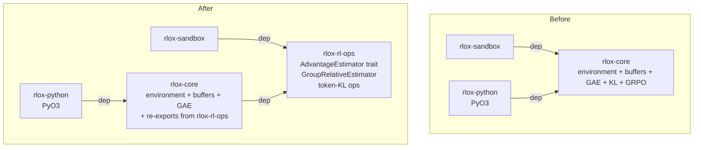
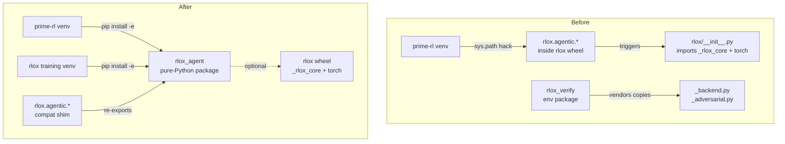
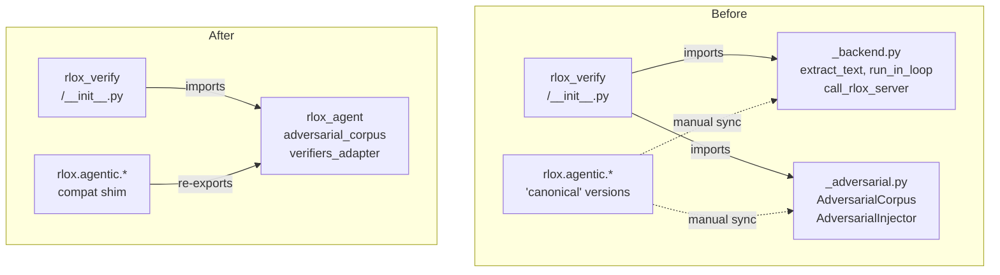
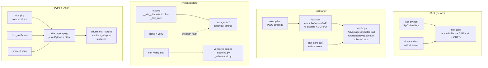
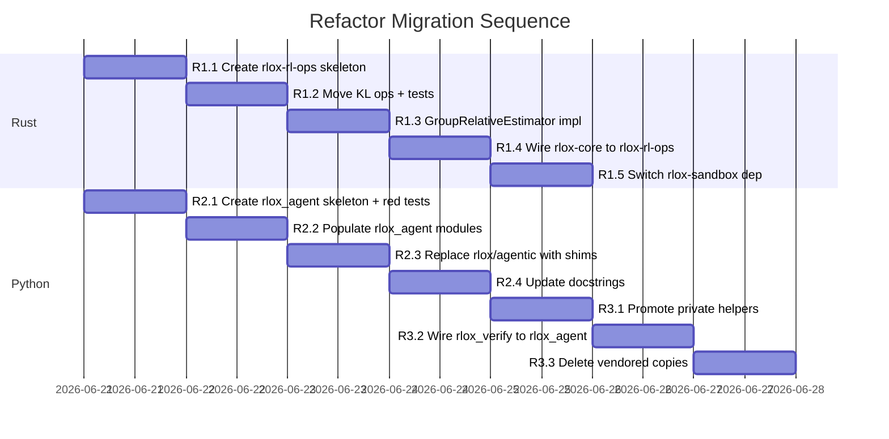

# Design: Agentic Ops and Package Refactor (Task #10)

Three coordinated refactors that untangle the post-MVP coupling between the Rust
data-plane crates, the Python training package, and the standalone verifiers
environment. They must be done in order: Refactor 1 unblocks no Python work,
Refactor 2 is independent of Refactor 1 but is a prerequisite for Refactor 3.

---

## Goal / Non-goals

**Goal.** Eliminate three coupling defects introduced during the MVP sprint:

1. `rlox-sandbox` depends on all of `rlox-core` (env physics, replay buffers,
   GAE, CUSUM …) just to call four arithmetic functions. Any future estimator
   algorithm change also forces a rebuild of the rollout server.
2. `import rlox.agentic.*` in a light environment (e.g. the prime-rl venv)
   triggers `rlox/__init__.py` which imports `_rlox_core` + torch. Tests
   currently work around this with `sys.path` surgery.
3. `rlox_verify/_backend.py` and `rlox_verify/_adversarial.py` are hand-copies
   of `rlox/agentic/verifiers_adapter.py` and `rlox/agentic/adversarial_corpus.py`
   — four files encoding the same dispatch and corpus logic, kept in sync manually.

**Non-goals.**

- Changing any reward signal, algorithm, or training hyperparameter.
- Exposing `rlox-rl-ops` as a published crate on crates.io.
- Unifying the Python and Rust venvs.
- Altering the `rlox-sandbox` HTTP contract (`/rollout`, `/verify`) or any
  existing public Python API surface (backward compatibility is required).
- Touching `rlox-python` (PyO3 bindings) beyond re-routing one import path.

---

## Constraints & Assumptions

- **Rust**: workspace resolver 2; `rlox-sandbox` is Linux-only (compile stubs for
  macOS/Windows must remain). New crate must join the workspace.
- **Python**: two distinct venvs in production — the `rlox` training venv
  (has torch + `_rlox_core`) and the prime-rl / verifiers venv (no torch). The
  standalone package from Refactor 2 must be installable in both.
- **No GPU sweep disruption**: the sweep on wk-system uses the current
  `rlox-sandbox` binary. Refactor 1 produces a functionally identical binary;
  no deployment changes are required during the sweep.
- **TDD convention**: red-green-refactor, test-architect then implementer.
- **Error type**: `rlox-core` uses `RloxError::ShapeMismatch`. The new crate
  defines its own error enum so it has zero dependency on `rlox-core::error`.
- **rayon** is already in `rlox-core`'s dependency tree; the new crate inherits
  this by declaring it independently at the same version (1.10).

---

## Refactor 1: Estimator-agnostic ops crate (`rlox-rl-ops`)

### Options Considered

| Option | How it works | Tradeoffs |
|---|---|---|
| A. Move ops into `rlox-sandbox` directly | Copy the four functions into sandbox | Zero new crate, but ops become un-reusable, tested only via the server, and not accessible from rlox-python |
| B. Feature-gate the ops in `rlox-core` | Add a `slim` feature that excludes env/buffer deps | Keeps one crate but the whole-crate dep remains; sandbox still pulls in replay-buffer code unless careful about feature unification |
| C. New `rlox-rl-ops` crate with trait | Slim crate: error type + trait + GRPO impl; sandbox and rlox-core both depend on it | One extra crate in the workspace; cleanest boundary; enables future DAPO/Dr. GRPO variants without server changes |

**Chosen: Option C.** Options A and B both preserve the coupling to `rlox-core`'s
build surface. Only C produces a dependency graph where `rlox-sandbox` compiles
independently of env physics and replay buffers, and where adding a second
estimator is additive (a new `impl AdvantageEstimator`), not invasive.

### Components & Interfaces

#### New crate: `crates/rlox-rl-ops/`

```
crates/rlox-rl-ops/
  Cargo.toml
  src/
    lib.rs          # re-exports: trait, error, grpo module
    error.rs        # RlOpsError (ShapeMismatch variant only for now)
    estimator.rs    # AdvantageEstimator trait
    grpo.rs         # GroupRelativeEstimator (GRPO impl)
    kl.rs           # token-KL ops (exact + Schulman, f64 + f32)
```

**`Cargo.toml` dependencies** (no `rlox-core`):

```toml
[dependencies]
rayon   = "1.10"
thiserror = "2"
```

**`src/error.rs`**

```rust
#[derive(Debug, thiserror::Error)]
pub enum RlOpsError {
    #[error("shape mismatch: expected {expected}, got {got}")]
    ShapeMismatch { expected: String, got: String },
}
```

**`src/estimator.rs`** — the pluggable trait

```rust
/// Compute per-rollout advantages from a flat slice of scalar rewards.
///
/// `rewards` is a flat slice of length `n_groups * group_size`.
/// Returns a `Vec` of the same length with per-rollout advantage estimates.
/// Implementations MUST be deterministic and free of autograd operations.
pub trait AdvantageEstimator: Send + Sync {
    fn compute(
        &self,
        rewards: &[f32],
        group_size: usize,
    ) -> Result<Vec<f32>, crate::error::RlOpsError>;
}
```

**`src/grpo.rs`** — canonical GRPO implementation

```rust
/// Group-Relative Policy Optimisation advantage estimator.
/// Normalises rewards within each group: z = (r - mean) / std.
/// Returns zeros when std < 1e-8 (constant-reward group).
pub struct GroupRelativeEstimator;

impl AdvantageEstimator for GroupRelativeEstimator {
    fn compute(
        &self,
        rewards: &[f32],
        group_size: usize,
    ) -> Result<Vec<f32>, RlOpsError> {
        // validation + rayon-parallel dispatch (threshold: 4096 elements)
        // identical math to the current rlox_core::llm::ops::f32_ops implementation
    }
}
```

**`src/kl.rs`** — token-level KL ops

Four free functions, generic over float type via `impl_kl_ops!` macro (transplanted
verbatim from `rlox-core/src/llm/ops.rs`):

```rust
pub fn compute_token_kl_f64(log_p: &[f64], log_q: &[f64]) -> Result<f64, RlOpsError>;
pub fn compute_token_kl_schulman_f64(log_p: &[f64], log_q: &[f64]) -> Result<f64, RlOpsError>;
pub fn compute_batch_token_kl_f64(log_p: &[f64], log_q: &[f64], seq_len: usize) -> Result<Vec<f64>, RlOpsError>;
pub fn compute_batch_token_kl_schulman_f64(log_p: &[f64], log_q: &[f64], seq_len: usize) -> Result<Vec<f64>, RlOpsError>;
// … and f32 variants
```

#### Changes to `rlox-core`

- `rlox-core/Cargo.toml` adds `rlox-rl-ops = { path = "../rlox-rl-ops" }`.
- `rlox-core/src/llm/ops.rs`: delete the macro-generated bodies; re-export from
  `rlox-rl-ops`. The public symbols (`compute_group_advantages`,
  `compute_batch_group_advantages`, `compute_token_kl`, etc.) remain in
  `rlox_core::llm::ops` as forwarding aliases so that `rlox-python` bindings
  and all existing callers are unaffected.
- `rlox-core/src/error.rs`: `RloxError` adds a `From<rlox_rl_ops::RlOpsError>`
  impl (one variant → one variant mapping).

#### Changes to `rlox-sandbox`

- `rlox-sandbox/Cargo.toml`: replace `rlox-core = { path = "../rlox-core" }` with
  `rlox-rl-ops = { path = "../rlox-rl-ops" }`.
- `rlox-sandbox/src/server.rs` line 345: replace
  `rlox_core::llm::ops::f32_ops::compute_batch_group_advantages`
  with
  `rlox_rl_ops::grpo::GroupRelativeEstimator.compute(...)`.
  The call-site changes from a bare function call to trait dispatch:

  ```rust
  use rlox_rl_ops::{AdvantageEstimator, grpo::GroupRelativeEstimator};
  // ...
  let estimator = GroupRelativeEstimator;
  let advantages = estimator
      .compute(&rewards, group_size)
      .unwrap_or_else(|_| vec![0.0f32; rewards.len()]);
  ```

  The `AppState` struct gains an `estimator: Arc<dyn AdvantageEstimator>` field,
  constructed once in `router_with_full_config`. This means future estimators are
  swappable via config without changing any handler code.

### Data Flow



### Implementation Plan — Refactor 1

**Step 1.1 — Create `rlox-rl-ops` crate skeleton.**
Add `crates/rlox-rl-ops/` with `Cargo.toml` (rayon + thiserror, no rlox-core),
`src/lib.rs` (empty stubs), `src/error.rs`, `src/estimator.rs`.
Add `rlox-rl-ops` to workspace `members`.
Acceptance: `cargo build -p rlox-rl-ops` succeeds, clippy clean.

**Step 1.2 — Move KL ops to `rlox-rl-ops`.**
Transplant `impl_kl_ops!` macro and its two instantiations from
`rlox-core/src/llm/ops.rs` into `rlox-rl-ops/src/kl.rs`. Adapt the error type
to `RlOpsError`. Migrate the existing unit tests (the 20+ tests in `ops.rs`) to
`rlox-rl-ops/src/kl.rs`.
Acceptance: `cargo test -p rlox-rl-ops` — all migrated tests pass.
`rlox-core/src/llm/ops.rs` re-exports from `rlox-rl-ops`; `cargo test -p rlox-core`
still green.

**Step 1.3 — Implement `GroupRelativeEstimator` in `rlox-rl-ops`.**
Implement `AdvantageEstimator` for `GroupRelativeEstimator` (math identical to the
existing f32 ops). The parallel threshold stays at 4096 elements.
Acceptance: `cargo test -p rlox-rl-ops` — group-advantage tests pass at f32 and f64.
`DPOPair` stays in `rlox-core` (it depends on nothing extracted here).

**Step 1.4 — Wire `rlox-core` to use `rlox-rl-ops`.**
Add `rlox-rl-ops` dep to `rlox-core/Cargo.toml`. Add `From<RlOpsError>` for
`RloxError`. Replace `llm/ops.rs` macro bodies with forwarding re-exports.
Acceptance: `cargo test --workspace` green. Public symbol set of `rlox_core::llm::ops`
unchanged (verified by running `cargo doc -p rlox-core` and diffing the symbol list).

**Step 1.5 — Switch `rlox-sandbox` off `rlox-core`.**
Replace dep in `Cargo.toml`; update `server.rs` to use `GroupRelativeEstimator` via
`Arc<dyn AdvantageEstimator>` in `AppState`.
Acceptance: `cargo build -p rlox-sandbox` succeeds. `cargo test -p rlox-sandbox`
(on macOS via compile stubs, on Linux via full integration) passes.
Binary size reduction is observable (rough validation only; no hard threshold).

---

## Refactor 2: Python package separation (`rlox-agent`)

### Options Considered

| Option | How it works | Tradeoffs |
|---|---|---|
| A. Namespace package `rlox.agentic` stays; fix `__init__.py` | Make `rlox/__init__.py` not import `_rlox_core` until first use | Still requires `rlox` (Maturin wheel) to be installed; won't work in a pure-Python venv |
| B. Move agentic to a new top-level `rlox_agent` package | Separate installable package with no torch/Rust deps; `rlox` optionally imported | Clean install boundary; works in both venvs; import path change is one-time, backward compat via deprecation shim |
| C. Extract to `rlox_agent` inside the existing `python/` tree but as a separate `pyproject.toml` | Sub-directory of the repo, own `pyproject.toml`, editable install | Same clean boundary as B but paths are slightly confusing in the monorepo layout |

**Chosen: Option B.** The root problem is that the Maturin-built `rlox` wheel is
not available in the prime-rl venv. No amount of lazy imports fixes that. A
separate installable package with only stdlib + verifiers + httpx as deps solves
the problem at the right level and makes the boundary explicit. Option C is
equivalent but B produces a cleaner directory structure (`python/rlox_agent/`
alongside `python/rlox/`).

### Components & Interfaces

#### New package: `python/rlox_agent/`

```
python/rlox_agent/
  pyproject.toml        # name="rlox-agent"; deps: httpx, verifiers (optional)
  rlox_agent/
    __init__.py         # no imports at module level — stdlib only
    adversarial_corpus.py  # verbatim from rlox/agentic/adversarial_corpus.py
    verifiers_adapter.py   # verbatim from rlox/agentic/verifiers_adapter.py
    stats.py               # verbatim from rlox/agentic/stats.py
    metric_collector.py    # verbatim from rlox/agentic/metric_collector.py
    contagion_detector.py  # verbatim from rlox/agentic/contagion_detector.py
    config.py              # verbatim from rlox/agentic/config.py
    reporting.py           # verbatim from rlox/agentic/reporting.py
```

`pyproject.toml` for `rlox-agent`:

```toml
[project]
name = "rlox-agent"
version = "0.1.0"
requires-python = ">=3.10"
dependencies = [
    "httpx>=0.25",
]

[project.optional-dependencies]
verifiers = ["verifiers>=0.1.15.dev0", "datasets>=2.14"]
torch = ["rlox"]  # optional: rlox wheel from Maturin

[build-system]
requires = ["hatchling"]
build-backend = "hatchling.build"
```

**Import contract.** Modules in `rlox_agent` import each other as siblings
(`from rlox_agent import adversarial_corpus`). They do NOT import from `rlox`
at the top level. Where an optional integration with `rlox` is needed (e.g.
accessing Rust KL ops for performance), it is gated:

```python
try:
    from rlox._rlox_core import compute_batch_token_kl_schulman as _fast_kl
    _HAVE_RUST = True
except ImportError:
    _HAVE_RUST = False
```

#### Changes to `python/rlox/agentic/`

After Refactor 2 lands, `python/rlox/agentic/` becomes a thin compatibility shim.
Each module is replaced by a one-liner re-export:

```python
# python/rlox/agentic/adversarial_corpus.py (post-refactor)
"""Backward-compat shim. Import from rlox_agent directly."""
from rlox_agent.adversarial_corpus import *  # noqa: F401, F403
from rlox_agent.adversarial_corpus import AdversarialCorpus, AdversarialInjector, \
    AdversarialSample, CorpusIntegrityError, canonical_digest
```

`rlox/agentic/__init__.py` comment updated to note the canonical home.

#### Test isolation

The `sys.path` workaround in tests (`tests/python/test_agentic_*.py`) is removed.
Tests `from rlox_agent import ...` directly. This is possible because `rlox-agent`
is a plain Python package installable with `pip install -e python/rlox_agent/`.

### Data Flow



### Implementation Plan — Refactor 2

**Step 2.1 — Create `rlox_agent` package structure with tests.**
(Test-architect writes failing tests first.)
Create `python/rlox_agent/` with `pyproject.toml` and empty `__init__.py`.
Write `tests/python/test_rlox_agent_imports.py` asserting that:
  - `from rlox_agent.adversarial_corpus import AdversarialCorpus` succeeds with
    no torch or `_rlox_core` on `sys.path`.
  - `from rlox_agent.verifiers_adapter import load_environment` succeeds when
    `verifiers` is available.
Acceptance: tests **fail** (ImportError — no content yet). `pip install -e python/rlox_agent/`
works in a bare venv with only httpx.

**Step 2.2 — Populate `rlox_agent` modules.**
Copy (not move) `adversarial_corpus.py`, `stats.py`, `contagion_detector.py`,
`metric_collector.py`, `config.py`, `reporting.py` into `rlox_agent/`.
Rewrite intra-package imports to use `rlox_agent.*` namespace.
Rewrite `verifiers_adapter.py` to import siblings from `rlox_agent`.
Acceptance: `tests/python/test_rlox_agent_imports.py` passes in a venv without torch.

**Step 2.3 — Replace `rlox/agentic/` modules with shims.**
Replace each source file with a re-export shim. Remove `sys.path` workarounds from
any existing test file that had them.
Acceptance: `pytest tests/python/ -q` — all previously-passing agentic tests still
pass (now via the shim path). `from rlox.agentic.adversarial_corpus import AdversarialCorpus`
still works in the full rlox venv.

**Step 2.4 — Update `rlox/agentic/__init__.py` docstring.**
Note canonical home (`rlox_agent`). No functional change.
Acceptance: `ruff check python/` clean.

---

## Refactor 3: Remove `rlox_verify` duplication

**Prerequisite: Refactor 2 must be complete** (`rlox_agent` package exists and is
installable without the Maturin wheel).

### Options Considered

| Option | How it works | Tradeoffs |
|---|---|---|
| A. Delete `_backend.py` / `_adversarial.py`; import from `rlox_agent` | `rlox_verify` declares `rlox-agent` as a dependency; removes copies | Single source of truth; the only real option once the standalone package exists |
| B. Keep vendored copies, add an automated sync test | Assert that the files are byte-for-byte identical via a CI test | Still two copies in the repo; synchronisation is still manual — just detected later |
| C. Move `rlox_verify` into `python/rlox_agent/` | Merge the two packages | Conflates training-plane and environment-plane concerns; `rlox_verify` has verifiers as a hard dep that `rlox_agent` treats as optional |

**Chosen: Option A.** Option B is a band-aid that preserves the problem; the only
reason the copies existed was that `rlox_agent` didn't exist as a standalone package.
Option C over-couples.

### Components & Interfaces

#### Changes to `environments/rlox_verify/`

`pyproject.toml` gains:

```toml
[project.dependencies]
"rlox-agent>=0.1.0",
"verifiers>=0.1.15.dev0",
"httpx>=0.25",
"datasets>=2.14",
```

(Note: `httpx` is now a transitive dep of `rlox-agent` but should remain explicit
here for clarity.)

`rlox_verify/_backend.py` is deleted. Its three functions (`extract_text`,
`run_in_loop`, `call_rlox_server`) are imported from `rlox_agent.verifiers_adapter`
in `rlox_verify/__init__.py`:

```python
from rlox_agent.verifiers_adapter import (
    _extract_text as extract_text,
    _run_in_loop as run_in_loop,
    _call_rlox_server as call_rlox_server,
)
```

`rlox_verify/_adversarial.py` is deleted. `rlox_verify/__init__.py` imports:

```python
from rlox_agent.adversarial_corpus import (
    AdversarialCorpus,
    AdversarialInjector,
    AdversarialSample,
    CorpusIntegrityError,
)
```

The private helper functions `extract_text`, `run_in_loop`, `call_rlox_server`
in `rlox/agentic/verifiers_adapter.py` must be promoted from `_` (private) to
module-level exports. Rename: `_extract_text` → `extract_text`, etc. (the leading
underscore was implementation-local; now they are part of the package API).

No functional change to `rlox_verify/__init__.py`'s `load_environment` logic.

### Data Flow



### Implementation Plan — Refactor 3

**Step 3.1 — Promote private helpers to public in `rlox_agent.verifiers_adapter`.**
Rename `_extract_text`, `_run_in_loop`, `_call_rlox_server` to remove leading
underscores. Update callers inside the module. Update shim in `rlox/agentic/verifiers_adapter.py`.
Acceptance: `pytest tests/python/ -q` still green. `ruff check python/` clean.

**Step 3.2 — Wire `rlox_verify` to `rlox_agent`.**
Add `rlox-agent` to `environments/rlox_verify/pyproject.toml` dependencies.
In `rlox_verify/__init__.py`, replace the import-from-`_backend`/`_adversarial`
blocks with import-from-`rlox_agent`.
Acceptance: `pip install -e environments/rlox_verify/ -e python/rlox_agent/` in a
clean venv (no `_rlox_core`). `python -c "from rlox_verify import load_environment; print('ok')"` succeeds.
`pytest environments/rlox_verify/tests/ -q` passes.

**Step 3.3 — Delete the vendored copies.**
Delete `environments/rlox_verify/rlox_verify/_backend.py` and `_adversarial.py`.
Acceptance: `pytest environments/rlox_verify/tests/ -q` still passes. `ruff check environments/` clean.

---

## Full Dependency Graph (Before / After)



---

## Ordered Migration Sequence

The three refactors are independent in one direction: Refactor 1 (Rust crate split)
is entirely orthogonal to Refactors 2 and 3 (Python package split). Refactor 3
depends on Refactor 2.



---

## Risks & Validation

**Risk 1 — Rayon version collision.**
`rlox-rl-ops` declares `rayon = "1.10"` and so does `rlox-core`. Cargo will unify
to a single version in the workspace. If a future `rayon` minor breaks the API,
both crates are affected together. Validation: `cargo tree -d` confirms no
duplicate rayon versions post-refactor.

**Risk 2 — `rlox-sandbox` macOS compile stubs.**
`rlox-sandbox` currently uses `#[cfg(target_os = "linux")]` guards. After removing
the `rlox-core` dep, the `RloxError` type is gone from sandbox entirely. The
macOS stub path in `server.rs` already has no error-type usage; confirm `cargo build --target aarch64-apple-darwin -p rlox-sandbox` passes as a CI check.

**Risk 3 — PyO3 binding symbol divergence.**
`rlox-python` binds `compute_group_advantages`, `compute_batch_group_advantages`,
and all KL variants from `rlox-core`. After Refactor 1, `rlox-core` re-exports
these from `rlox-rl-ops`. The PyO3 binding code in `rlox-python/src/` calls
`rlox_core::llm::ops::*` which now aliases through. No binding change required.
Validation: `maturin develop --release && python -c "from rlox import compute_batch_group_advantages; print(compute_batch_group_advantages([1.0,2.0,3.0], 3))"` returns the expected tensor.

**Risk 4 — `verifiers_adapter.py` private-function promotion.**
Step 3.1 renames `_extract_text` → `extract_text`. If any code outside this repo
or outside the tests imports the private names, it breaks. Search confirms no
external callers: `_extract_text`, `_run_in_loop`, `_call_rlox_server` appear only
in `verifiers_adapter.py` itself and `rlox_verify/__init__.py`. The shim in
`rlox/agentic/verifiers_adapter.py` re-exports the old name for the grace period.

**Risk 5 — Future DAPO estimator.**
Once `rlox-rl-ops` exists, adding a DAPO estimator is:

```rust
// crates/rlox-rl-ops/src/dapo.rs
pub struct DAPOEstimator { pub clip_lower: f32, pub clip_upper: f32 }
impl AdvantageEstimator for DAPOEstimator { ... }
```

The rollout server switches by injecting a different `Arc<dyn AdvantageEstimator>`
in `router_with_full_config`. No handler code changes. This validates the trait
design choice.

---

## Open Questions

None blocking design. For implementer awareness:

1. `DPOPair` lives in `rlox-core/src/llm/ops.rs` (it's in the same file). It does
   NOT move to `rlox-rl-ops` because it has no mathematical relationship to
   advantage estimation; it is a data container for the RLHF training loop in
   Python. Leave it in `rlox-core`.

2. The `rlox_agent` package version should be `0.1.0` for now, matching
   `rlox-verify`'s `0.1.0`. Consider a shared versioning policy once both
   packages stabilise.

3. Whether to publish `rlox-rl-ops` as a standalone crate on crates.io is a
   future decision. The workspace path dep is sufficient for now.
