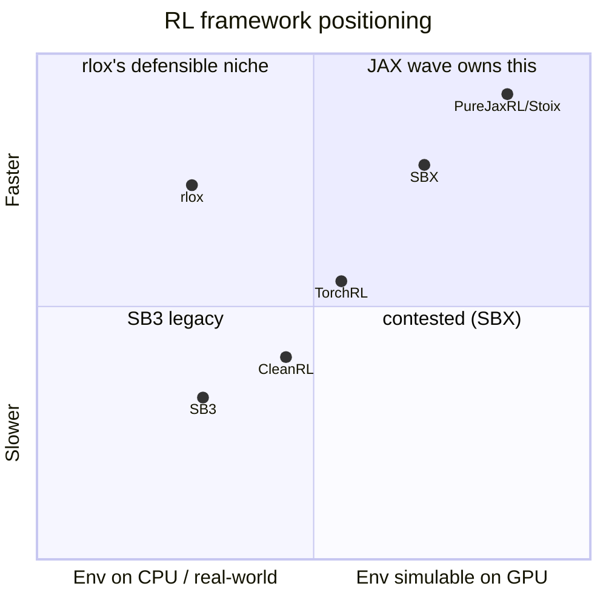

# rlox classical-RL library — review & improvement opportunities

> Date: 2026-06-21
> Scope: the **core RL framework** (Rust data plane + PyTorch control plane, 22
> algorithms, SB3 parity on the core six). Explicitly **excludes** the
> agentic-RL / sandbox / LLM-post-training track, which is a separate workstream.
> Sources: a ground-truth internal code audit + an external SOTA/competitive
> research pass, both verified against the code (not the docs).

---

## TL;DR

rlox is in good shape where it counts: the Rust data plane is real and
benchmarked, and **5 algorithms (PPO/SAC/TD3/DQN/A2C) are genuinely
battle-tested** with multi-seed SB3 parity. The biggest issues are **honesty of
the surface area** (15 of 22 algorithms are structurally complete but
unvalidated, one is broken), a few **correctness gaps in the distributed path**,
and a **strategic positioning question** about where to invest next given the
JAX wave.

The single most important strategic conclusion:

> **Do not try to out-throughput JAX.** rlox's defensible niche is "the fast
> PyTorch RL library for environments you *can't or won't* put on a GPU" — real
> hardware, external/networked sims, latency-sensitive single-stream stepping,
> POMDPs, and non-JAX users. Invest there; cede simulable-on-GPU throughput
> racing to PureJaxRL/Stoix/SBX.

---

## Part 1 — Internal maturity map (what's actually real)

### Algorithm tiers

| Tier | Meaning | Algorithms |
|---|---|---|
| **A — battle-tested** | Multi-seed convergence parity vs SB3, has preset configs | PPO, SAC, TD3, DQN, A2C |
| **B — implemented, unvalidated** | Structurally complete + smoke/unit tests, **no convergence evidence** | TRPO, VPG, IMPALA, MAPPO, MPO, DreamerV3, QMIX, CalQL, DiffusionPolicy, DecisionTransformer, IQL, CQL, BC, TD3-BC, HybridPPO |
| **C — broken/stub** | Latent bug or incomplete | **AWR** (`predict()` references `self.policy.actor`, which is never assigned — `AttributeError` at inference) |

**TRPO is the obvious promotion candidate** — full CG + line search is
implemented and unit-tested; it just lacks a convergence config and a sweep.

### Rust data plane — real coverage

**Genuinely accelerated and reproducible:**
- `compute_gae` / `compute_gae_batched` — **54–155x** vs NumPy loop (the
  README's "140x" sits mid-range; real).
- `ReplayBuffer` + `PrioritizedReplayBuffer` (segment-tree sumtree), **n-step
  returns, HER relabeling, dueling/Rainbow DQN extensions** — all already in
  Rust. (This corrects a common assumption — these do *not* need rebuilding.)
- `VecEnv` Rayon-parallel stepping; `compute_vtrace`.

**Weaker than the docs imply:**
- **Only 3 native Rust envs** (CartPole, Pendulum, NonStationaryCartPole — the
  last has no PyO3 binding). `mujoco.rs` is a **stub** (`SimplifiedMuJoCoEnv` =
  random linear dynamics); all MuJoCo training goes through Gymnasium's Python/C
  binding, not Rust.
- VecEnv is **slower than gym_sync at 4–16 envs** (Rayon overhead), only winning
  at n_envs ≥ 64. The "2.7M steps/s @ 512 envs" figure is **not reproducible**
  from stored results (ablation data stops at 256 envs).

### NN backends

- **PyTorch is the only real training backend.** All 22 algorithms call
  `loss.backward()`.
- **rlox-candle** is real but reachable only via `HybridPPO` (CartPole, discrete
  only). Two gradient-flow tests are `#[ignore]`'d as "flaky."
- **rlox-burn** has 48 Rust tests and **zero Python-facing code** — fully
  orphaned. Wire it to one path or delete it.

### Distributed (rlox-grpc)

Scaffold level. The protocol compiles and the Python `RemoteEnvPool` wiring
exists, but: **zero Rust `#[test]` blocks**, no end-to-end server↔client test,
and a **correctness bug** — `client.rs:59` hardcodes `terminal_obs: vec![None;
num_envs]`, dropping truncation bootstrap values (breaks value targets on every
truncating env, i.e. all MuJoCo) under distributed IMPALA.

### Architectural debt (low-risk cleanups)

- `_RUST_NATIVE_ENVS` set is **copy-pasted** across `ppo.py`, `trpo.py`,
  `vpg.py` instead of importing the existing `_NATIVE_ENV_IDS`.
- Double registration: 4 algos are registered both by `@register_algorithm` and
  in `_register_builtins()` (guarded, harmless, confusing).
- A2C has no `Config` dataclass (inconsistent with PPO/SAC/DQN).
- DQN uses MSE not Huber (documented divergence from SB3; "tracked follow-up"
  with no linked issue).

---

## Part 2 — External opportunities (where to invest)

### Competitive position

The JAX crowd puts the **env inside XLA**, deleting the CPU↔GPU copy that rlox
keeps — so racing them on Atari/Brax throughput is structurally unwinnable.
rlox's edge is everywhere the env *can't* be jitted.

### Ranked bets

```mermaid
flowchart LR
    subgraph P0["P0 — credibility & correctness (do first)"]
        A1[Fix AWR predict bug]
        A2[Maturity labels on algos]
        A3[Fix grpc terminal_obs + add e2e test]
        A4[Scope perf claims honestly]
    end
    subgraph P1["P1 — highest-leverage features"]
        B1[Recurrent policies LSTM/GRU]
        B2[CrossQ + TQC]
        B3[PQN parallelised Q-learning]
    end
    subgraph P2["P2 — reach & adoption"]
        C1[Bind EnvPool/Brax]
        C2[W&B + surface RLiable eval]
        C3[Optuna + tuned-config zoo]
        C4[Gymnasium 1.x + wheel matrix]
    end
    P0 --> P1 --> P2
```

#### P0 — Credibility & correctness (cheap, high trust payoff)

| Item | Why | Effort | Status |
|---|---|---|---|
| **Fix AWR `predict()`** | Shipped an `AttributeError` at inference; added discrete/continuous predict tests | **S** | ✅ done (2026-06-21) |
| **Per-algorithm maturity label** (`ALGORITHM_STATUS` dict, `Trainer.status`, repr + experimental `UserWarning`) | The "22 algorithms" claim implies all are production-ready; 13 of 18 registered are experimental | **S** | ✅ done (2026-06-21) |
| **Fix grpc `terminal_obs` + e2e test** | Silent correctness bug on truncating envs; also closed the zero-Rust-tests gap on `rlox-grpc` | **M** | ✅ done (2026-06-21) |
| **Re-scope perf claims** in README | "3–50x" and "2.7M steps/s" hold only in narrow conditions; VecEnv is *slower* at 4–16 envs | **S** | ⏳ pending (wording sign-off) |
| ~~Hoist `_RUST_NATIVE_ENVS` to shared constant~~ | **Dropped — not duplication.** Per-algo `{CartPole}` is an intentional discrete-only subset of `collectors._NATIVE_ENV_IDS = {CartPole, Pendulum}`; hoisting would route Pendulum through the Rust VecEnv for PPO/TRPO/VPG and change behavior. | — | ❌ won't do |
| Decide rlox-burn (wire to a Python path or delete) | 48 Rust tests, zero Python reach | **S** | ⏳ pending |

> **Implementation notes (2026-06-21):** the three completed items were done
> TDD-style (separate test-author / implementer agents) and passed independent
> code review. The maturity-label work initially over-reached — the implementer
> added a construction-error *deferral* to `Trainer` and weakened
> `mpo.py`/`dtp.py` constructors to satisfy a test that built every experimental
> algo on CartPole. Review flagged it 🔴 (late/confusing errors; MPO silently
> building a broken agent on a discrete env). **Reverted** in favor of a
> `catch_warnings(record=True)` test pattern, since the warning fires *before*
> construction — no production behavior change was needed. Lesson: bend the test
> harness, not production error semantics, to make a test pass.

#### P1 — Highest-leverage new capability (plays *to* the niche)

| Bet | Gap & why it matters | Effort | Niche fit |
|---|---|---|---|
| **Recurrent policies (LSTM/GRU)** for PPO/SAC/DQN | The biggest real algorithmic hole — `policies.py` has no recurrence (only DreamerV3 internally). POMDPs/partial-observability are exactly the "real env" cases rlox should own. Needs recurrent **sequence batching** — and that batching is legitimate new **Rust** data-plane work. | **L** | ★★★ reinforces niche |
| **CrossQ + TQC** | Cheapest credibility win in modern continuous control; both recommended in the SB3 maintainer's own SOTA-2026 deck. TQC is a small delta on existing SAC twin-critic; CrossQ removes target nets via BatchNorm. | **M** | ★★ |
| **PQN** (parallelised Q-learning, arXiv:2407.04811) | The one modern algorithm whose design *wants* a fast vectorized env loop — rlox's Rayon `VecEnv` is the ideal host. Pure architectural synergy. | **M** | ★★★ |

#### P2 — Reach & adoption (non-algorithmic, drives real usage)

| Item | Gap | Effort |
|---|---|---|
| **Bind EnvPool / Brax** for high-throughput envs | Don't reimplement ALE/MuJoCo in Rust (money pit). Bind the fast suites; keep a *small* curated native Rust env set for the niche demo. | **M** |
| **W&B callback + surface RLiable-grade eval** | `evaluation.py` already has IQM + bootstrap CI — it's just not front-and-center. W&B is table stakes for adoption. | **S–M** |
| **Optuna integration + rl-zoo3-style tuned-config repo** | Tuned hyperparameters + published checkpoints are a top adoption driver SB3 proved out. | **M** |
| **Remaining Rust data-plane moves** | VecNormalize/wrapper loop (still Python in `vec_normalize.py`), image preprocessing, recurrent sequence batching. The genuinely-still-in-Python transforms. | **M** |
| **Gymnasium 1.x currency + PyPI wheel matrix audit** | Hygiene; broadens install base. | **S** |

### Explicit non-goals (do NOT do)

- ❌ Build a JAX backend or race JAX on GPU-simulable throughput — structurally unwinnable.
- ❌ Reimplement ALE / real MuJoCo physics in Rust — bind existing suites instead.
- ❌ Rebuild PER / HER / n-step "in Rust" — **already done.**

---

## Suggested sequencing

1. **Sprint 1 (P0):** AWR fix, maturity labels, grpc `terminal_obs` + e2e test,
   README claim re-scoping, constant hoist. All small, all trust-building.
2. **Sprint 2 (P1 quick wins):** CrossQ + TQC (reuse SAC machinery), then PQN
   (showcases the VecEnv advantage).
3. **Sprint 3+ (P1 flagship):** Recurrent policies + Rust sequence batching —
   the capability that most reinforces the defensible niche.
4. **Ongoing (P2):** EnvPool/Brax binding, W&B, surfaced RLiable eval, tuned
   configs — fold in alongside the above.

---

## Open questions to resolve before committing

1. Origin of "2.7M steps/s @ 512 envs" — theoretical extrapolation or a real
   microbenchmark not in `results/`? Either reproduce it or drop it.
2. Are the `#[ignore]`'d Candle gradient-flow tests a real correctness risk, or
   genuinely just seed sensitivity? Diagnose before building on Candle.
3. Keep or cut **rlox-burn**? 48 tests, zero Python reach.
4. Validation env for QMIX/MAPPO (no cooperative-MARL benchmark env is bundled).
5. DQN MSE-vs-Huber — permanent decision or tracked fix?
