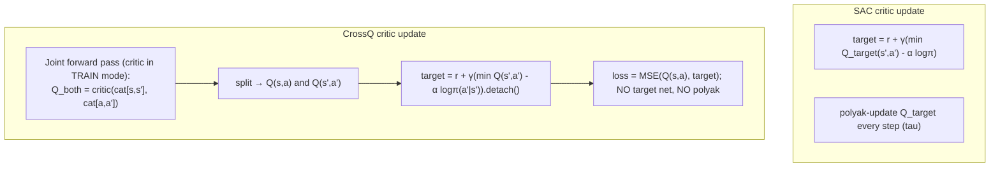

# CrossQ — design & implementation plan

> Date: 2026-06-23
> Status: design → implementation (P1 feature)
> Paper: Bhatt, Palenicek et al., *CrossQ: Batch Normalization in Deep RL for
> Greater Sample Efficiency and Simplicity* (ICLR 2024, arXiv:1902.05605)
> Reference impl: SB3-contrib `CrossQ`.

## Why CrossQ

A **drop-in SAC upgrade** for continuous control: removes the target networks
entirely and instead stabilises TD learning with **Batch Renormalization** in the
critic, matching/beating SAC sample efficiency at UTD=1 (no expensive ensembles
like REDQ/DroQ). High credibility-per-effort — it reuses rlox's SAC machinery
(replay buffer, squashed-Gaussian actor, auto-entropy) almost wholesale.

## CrossQ = SAC minus target nets, plus BatchRenorm + joint forward pass



**The three deltas from rlox SAC (`python/rlox/algorithms/sac.py`):**

| | SAC | CrossQ |
|---|---|---|
| Target critics | `critic{1,2}_target` + polyak (`tau`) | **removed** |
| Critic normalisation | plain `QNetwork` | **`BatchRenorm1d` after each hidden linear** |
| TD target | `critic_target(s',a')` | **joint forward pass**: `(s,a)` and `(s',a')` through the live critic *in one batch, train mode* → use the `(s',a')` half (detached) |
| Actor update cadence | every step | every `policy_delay` (default **3**) critic updates |

Everything else — replay buffer, `SquashedGaussianPolicy` actor, automatic
entropy tuning, `min(Q1,Q2)` — is unchanged from SAC.

### The joint forward pass (the crux — get this right)

The reason CrossQ works without target nets: BatchNorm statistics must be
*consistent* between the value being trained, `Q(s,a)`, and its bootstrap,
`Q(s',a')`. Computing them in separate forward passes (or via a frozen target)
gives mismatched batch statistics and diverges. So:

```python
self.critic1.train(); self.critic2.train()         # BN uses BATCH stats
cat_obs = torch.cat([obs, next_obs], dim=0)         # (2B, obs_dim)
cat_act = torch.cat([act, next_act], dim=0)         # next_act ~ π(·|next_obs)
q1_both = self.critic1(cat_obs, cat_act)            # (2B, 1)
q2_both = self.critic2(cat_obs, cat_act)
q1, q1_next = q1_both.split(B); q2, q2_next = q2_both.split(B)
q_next = torch.min(q1_next, q2_next) - alpha * next_logp
target = (reward + gamma * (1 - done) * q_next).detach()   # detach the bootstrap half
critic_loss = mse(q1, target) + mse(q2, target)
```

The bootstrap half is **detached** (no grad through the target), but it shares the
*same BN statistics* as the trained half because they went through together.

### BatchRenorm1d (new module)

PyTorch has no BatchRenorm. Implement `BatchRenorm1d` (Ioffe 2017): like
BatchNorm1d but the normalisation uses corrected statistics with clipped
`r ∈ [1/r_max, r_max]` and `d ∈ [-d_max, d_max]` relating batch stats to running
stats; during the first `renorm_warmup_steps` it behaves as plain BatchNorm
(`r=1, d=0`), then the clip ranges relax. Eval mode uses running stats. Defaults:
`momentum=0.01`, `eps=1e-3`, `warmup_steps=100_000`.

## Public API

```python
from rlox import Trainer
trainer = Trainer("crossq", env="Pendulum-v1",
                  config={"hidden": 256})  # paper uses [1024,1024]; smaller for cheap envs
metrics = trainer.train(total_timesteps=20_000)
```

`CrossQ.__init__(env_id, learning_rate=1e-3, gamma=0.99, batch_size=256,
learning_starts=1000, train_freq=1, gradient_steps=1, policy_delay=3,
hidden=256, auto_entropy=True, target_entropy=None, ent_coef="auto",
bn_momentum=0.01, bn_eps=1e-3, renorm_warmup_steps=100_000, seed=42, ...)`.
**Continuous action spaces only** (raise on discrete). Methods mirror SAC
(`train`, `predict(deterministic)`, `save`/`from_checkpoint`). Critic has NO
`*_target` attribute; `tau`/polyak absent.

Registry: `("crossq", CrossQ)` in `_register_builtins()`; status **experimental**.

## TDD plan
1. **RED (`test-architect`)** — `tests/python/test_crossq.py`: construct on
   `Pendulum-v1` (continuous); discrete env raises; **no target-critic attribute,
   no `tau`**; critic contains `BatchRenorm1d`; a short `train()` returns finite
   metrics; `predict` returns an action in-bounds; `policy_delay` actually delays
   actor updates; `Trainer("crossq").status == "experimental"`. A small unit test
   for `BatchRenorm1d` (train vs eval behaviour; running stats update). A `slow`
   Pendulum convergence test (reward improves well above random ≈ −1200 → ≳ −300).
2. **GREEN (`python-expert`)** — `BatchRenorm1d` + `BNQNetwork` in `networks.py`;
   `crossq.py` reusing SAC's replay/actor/entropy; the joint-forward-pass critic
   update; `policy_delay`; registry + config + `__init__` export.
3. **REVIEW (`code-reviewer`)** — focus: the joint forward pass (train mode,
   correct split, detached bootstrap, BN-stat consistency), BatchRenorm
   correctness (warmup, eval uses running stats), no-target invariant, entropy/min-Q
   handling, continuous-only guard.
4. **DOCS + (later) validation** — changelog, algorithm reference; full MuJoCo
   sample-efficiency comparison as follow-up.

## Acceptance criteria
- No target-critic / `tau` on `CrossQ`; critic uses `BatchRenorm1d`.
- Critic update uses a single joint forward pass with a detached bootstrap half.
- Learns Pendulum-v1 in a short budget (slow test).
- Reuses SAC's replay buffer, actor, and entropy tuning (no duplication).
