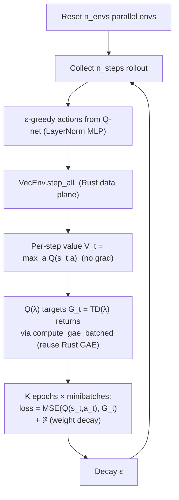

# PQN (Parallelised Q-Network) — design & implementation plan

> Date: 2026-06-21
> Status: design → implementation (P1 feature from the classical-RL review)
> Paper: Gallici et al., *Simplifying Deep Temporal Difference Learning*
> (arXiv:2407.04811)

## Why PQN for rlox

PQN is the modern algorithm whose design **best exploits rlox's Rayon `VecEnv`**:
it is value-based RL that runs on many parallel environments with **no replay
buffer and no target network**, relying instead on **LayerNorm + ℓ²
regularisation** to stabilise TD learning, and **λ-returns** computed over the
parallel rollouts. The tight, vectorised env-stepping loop is exactly rlox's
data-plane strength — so PQN is an architectural showcase, not just another algo.

## Algorithm (as implemented here)



**Key properties (vs DQN):**

| | DQN | PQN |
|---|---|---|
| Replay buffer | ✅ | ❌ (on-policy rollouts, discarded) |
| Target network | ✅ | ❌ (LayerNorm stabilises instead) |
| Normalisation | none | **LayerNorm** in the Q-net (the load-bearing ingredient) |
| Returns | 1-step / n-step | **λ-returns** Q(λ) |
| Parallelism | 1 env + replay | **many parallel envs** |
| Core hyperparams | many | n_envs, lr, ε(+decay), λ |

## rlox integration — what's reused vs new

- **Reuse `compute_gae_batched` (Rust) for the Q(λ) targets.** The TD(λ) return
  is exactly GAE's `returns` output. Feed it `rewards`, `values = max_a Q(s_t,a)`
  (computed no-grad), `dones`, `last_value = max_a Q(s_{n_steps},a)`, `gamma`,
  `lam = q_lambda`; take the `returns`, ignore `advantages`. **No new Rust op** —
  honours the reuse rule and the Polars data-plane rule (the return transform is
  already in Rust).
- **Reuse `rlox.VecEnv`** for native envs (CartPole) and `GymVecEnv` otherwise —
  same path PPO/A2C use via `collectors.py`.
- **New: a LayerNorm Q-network** (`LayerNormQNetwork` in `networks.py` or local to
  `pqn.py`) — MLP with `LayerNorm` after each hidden linear. This is the one
  genuinely new component and the core of PQN.
- **New: `pqn.py`** algorithm module + `PQNConfig` dataclass + registry wiring.

## Public API

```python
from rlox import Trainer
trainer = Trainer("pqn", env="CartPole-v1",
                  config={"n_envs": 16, "n_steps": 32, "q_lambda": 0.65})
metrics = trainer.train(total_timesteps=200_000)
```

`PQN.__init__(env_id, n_envs=8, n_steps=32, learning_rate=2.5e-4, gamma=0.99,
q_lambda=0.65, num_epochs=4, num_minibatches=4, max_grad_norm=10.0,
weight_decay=0.0, hidden=128, eps_start=1.0, eps_end=0.05,
exploration_fraction=0.5, seed=42, ...)`. **Discrete action spaces only**
(value-based). Methods mirror the other algos: `train(total_timesteps) -> dict`,
`predict(obs, deterministic=True) -> int` (greedy / ε-greedy), `save`/`load`.

Registry: add `("pqn", PQN)` to `_register_builtins()`; status **experimental**
in `ALGORITHM_STATUS` (will move to validated once a multi-seed sweep lands).

## TDD plan

1. **RED (`test-architect`)** — `tests/python/test_pqn.py`: construction on
   `CartPole-v1`; Q-net has LayerNorm; one `train()` step runs and returns finite
   loss/metrics; **no replay buffer and no target network attributes exist**
   (asserts the PQN contract); `predict()` returns a valid discrete action;
   ε decays from `eps_start` toward `eps_end`; Q(λ) target shape matches
   `n_envs*n_steps`; `Trainer("pqn", ...)` resolves and `.status == "experimental"`.
2. **GREEN (`python-expert`)** — implement `pqn.py` + `LayerNormQNetwork` +
   `PQNConfig` + registry, reusing `compute_gae_batched` for the targets. No test
   edits.
3. **REVIEW (`code-reviewer`)** — correctness of the Q(λ) target (boundary/done
   handling, bootstrap), LayerNorm placement, no-target/no-replay invariant, grad
   clipping, ε schedule.
4. **DOCS** — add PQN to the algorithm reference + changelog; register status.
5. **(Later) validation** — a multi-seed CartPole sweep to promote to *validated*.

## Acceptance criteria
- `Trainer("pqn", env="CartPole-v1").train(...)` learns CartPole (reward rises
  well above random over a short budget) — smoke-level convergence in a `slow`
  test.
- No `target_network` / replay-buffer attributes on `PQN`.
- Q-net contains `nn.LayerNorm` layers.
- Reuses `compute_gae_batched`; no new Rust.
