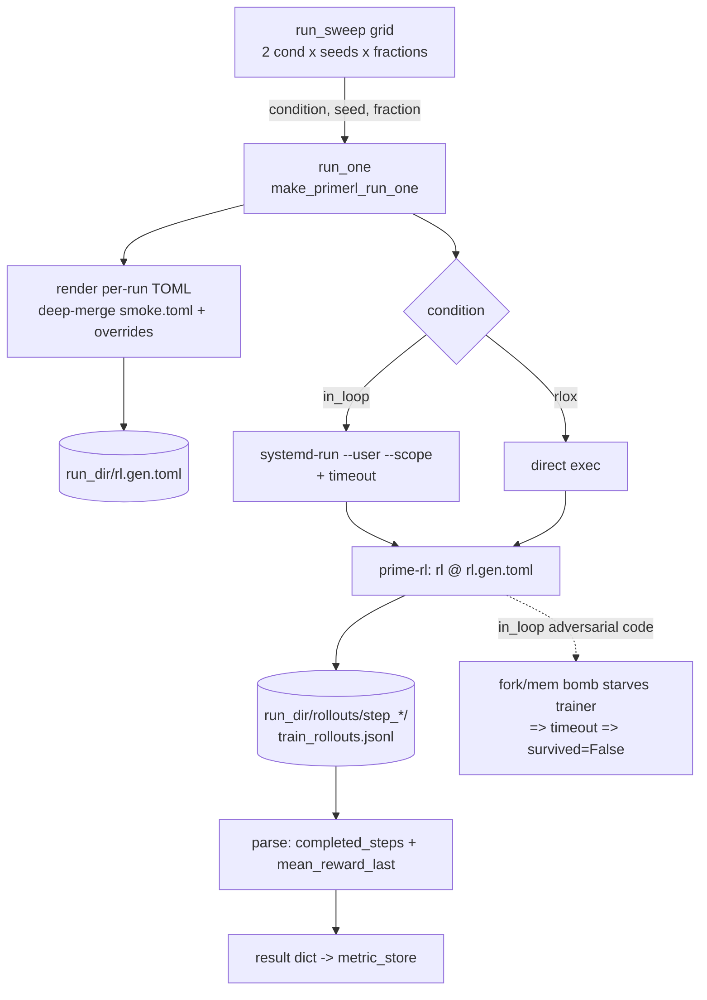
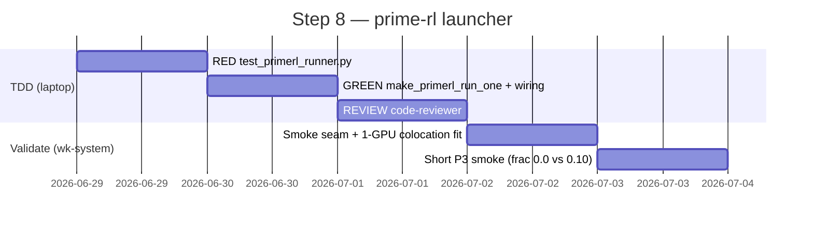

# Step 8 — prime-rl GRPO launcher (`make_primerl_run_one`)

**Goal.** Wire the benchmark's *locked* host (prime-rl + `verifiers`, no-fork) end-to-end so
the agentic P3 study runs on prime-rl, not just the TRL single-GPU fallback. Replace the
`raise SystemExit("…wired at Step 8")` in `benchmarks/agentic/run_benchmark.py:272` with a real
prime-rl `run_one`, drop it into the existing `run_sweep`, and smoke-validate the
prime-rl → `rlox_verify` → `/verify` Treatment seam on `wk-system`.

**Non-goals.** Multi-GPU P1 throughput (deferred, GCP). Changing the env, corpus, reward, or any
sandbox contract. Re-running the canonical P3 number (TRL result stays canonical until a
prime-rl sweep supersedes it).

---

## Contract (grounded in the live prime-rl install on wk-system)

| concern | mechanism |
|---|---|
| invocation | `CUDA_VISIBLE_DEVICES=0 <prime_rl_venv>/bin/rl @ <run>.toml --output-dir <run_dir> --max-steps N` |
| per-run config | deep-merge base `primerl/smoke.toml` + overrides → render `<run_dir>/rl.gen.toml` |
| Baseline↔Treatment swap | `orchestrator.train.env[0].args.rollout_backend ∈ {in_loop, rlox}` |
| adversarial injection | `orchestrator.train.env[0].args.adversarial_fraction` |
| completed steps | count `<output_dir>/rollouts/step_*` dirs (written every train step) |
| `mean_reward_last` | mean of `reward` field in last `rollouts/step_N/train_rollouts.jsonl` |
| survival | `returncode == 0` **and** `completed_steps >= max_steps`; timeout/crash ⇒ `False` |
| host safety (Baseline) | wrap `in_loop` in `systemd-run --user --scope -p TasksMax=2048 -p MemoryMax=40G timeout <T>` |
| return dict | `{condition, seed, fraction, survived, completed_steps, elapsed_secs, mean_reward_last}` — identical shape to `make_trl_run_one`, so `run_sweep` is unchanged |

### Why template a TOML (not CLI overrides)
The env config is a TOML **list** (`[[orchestrator.train.env]]`) with a nested `args` dict. The
`rl` CLI's `@`-file + `--key.sub` override syntax is awkward for list-element dict keys; rendering a
per-run TOML is deterministic, inspectable (the `.gen.toml` is an artifact), and matches how
`write_config` round-trips config in prime-rl itself.

---

## Architecture



```mermaid
sequenceDiagram
    participant S as run_sweep
    participant R as run_one (primerl)
    participant T as TOML renderer
    participant P as prime-rl (rl)
    participant V as rlox-verify-server (/verify)
    S->>R: (condition, seed, fraction)
    R->>T: deep_merge(smoke.toml, overrides)
    T-->>R: run_dir/rl.gen.toml
    R->>P: rl @ rl.gen.toml --output-dir run_dir --max-steps N
    loop each GRPO step
        P->>V: POST /verify {code, tests, is_adversarial}  (Treatment only)
        V-->>P: {reward, backend_stats}
        P->>P: write rollouts/step_k/train_rollouts.jsonl
    end
    P-->>R: exit code
    R->>R: count step_* dirs; mean(reward) of last step
    R-->>S: {survived, completed_steps, mean_reward_last, elapsed_secs}
```

---

## TDD plan (test-architect → python-expert → code-reviewer)

All unit tests run on the **laptop, no GPU**: the launcher is command-construction + subprocess +
output-dir parsing. A tiny fake `rl` shell stub fabricates `rollouts/step_*/train_rollouts.jsonl`
to exercise the parser and survival logic.

### RED — `tests/agentic/test_primerl_runner.py` (test-architect)
1. `make_primerl_run_one` returns a callable with the `make_trl_run_one` signature/return keys.
2. TOML templating: rendered `rl.gen.toml` deep-merges base + sets
   `env[0].args.rollout_backend`, `adversarial_fraction`, `max_steps`, `output_dir`,
   `wandb.name`; base keys (model, lora, inference) preserved.
3. Command assembly: `rlox` → direct; `in_loop` → `systemd-run … timeout … rl @ …`;
   `CUDA_VISIBLE_DEVICES=0` set.
4. Survival parse (fake `rl` stub): reached `max_steps` & rc 0 ⇒ `survived=True`,
   `completed_steps == max_steps`.
5. DNF parse: stub exits non-zero after k<max_steps ⇒ `survived=False`, `completed_steps == k`.
6. Timeout: stub sleeps past a short cap ⇒ `survived=False`.
7. `mean_reward_last` = mean of `reward` in last `train_rollouts.jsonl`; missing rollouts ⇒ `0.0`.

### GREEN — `make_primerl_run_one` in `run_benchmark.py` (python-expert)
- `_render_run_toml(base_toml, overrides, dest)` — stdlib `tomllib` read + `tomli_w` write
  (already a prime-rl dep; for the repo side use `tomli_w` if present else a minimal writer, or
  require `tomli-w` in the agentic extra). Deep-merge helper.
- `_count_completed_steps(output_dir)` / `_last_step_mean_reward(output_dir)`.
- `run_one` mirrors `make_trl_run_one`'s structure (systemd wrap for `in_loop`, env, timeout,
  exception → `survived=False`).
- Wire `_main`: dispatch `--host {trl,primerl}` (default `trl` keeps current behavior); add
  `run_sweep_primerl.py` mirroring `run_sweep_p3.py` (paths, server URL, `make_primerl_run_one`).

### REVIEW — code-reviewer
Correctness of survival semantics vs. the metric-store DNF convention, host-safety wrap parity,
no regression to `make_trl_run_one` / `run_sweep`, stdlib-only import constraint of
`run_benchmark.py` (tomllib is 3.11+ stdlib; `tomli_w` is the only new dep — gate it).

### VALIDATE — wk-system (smoke, single GPU)
`run_sweep_primerl.py` with `max_steps≈8`, fractions `[0.0, 0.10]`, 1 seed, server up:
prove the seam (prime-rl drives `rlox-verify`, Treatment hits `/verify`) and that `in_loop` at
10% stalls→timeout while `rlox` survives. Colocation fit (vLLM `gpu_memory_utilization=0.40` +
LoRA trainer on one 5090) is the open empirical question this smoke answers.

---

## Sequence



## Risks
- **1-GPU colocation OOM** — vLLM + LoRA trainer on one 5090. Mitigation: `gpu_memory_utilization`
  down-tune, `max_model_len`/`seq_len` cap; if infeasible, the launcher is still correct and the
  full prime-rl P3 sweep moves to GCP multi-GPU (the launcher is host-count-agnostic).
- **Reward field name drift** — parse `reward` per rollout row; fall back to `0.0` and log if absent.
- **`tomli_w` dependency** — add to the agentic extra; keep `run_benchmark.py` importable without
  torch/vllm (constraint already enforced).

---

## Validation results (wk-system, single RTX 5090)

**Launcher: validated.** `make_primerl_run_one` renders the per-run TOML, invokes `rl`, and
correctly classifies outcomes. First probe returned `survived:false, completed_steps:0` in 7.6 s
when prime-rl rejected the GPU count — the DNF path works.

**Key finding — prime-rl's integrated `rl` launcher needs 2 GPUs.** `rl_local` assigns inference
and the trainer *disjoint* physical GPUs (`total = num_infer_gpus + num_train_gpus`), so the
integrated path floors at 2. This is exactly why the canonical study used the TRL fallback.

**1-GPU decoupled recipe (built + working).** Run vLLM as an *external* server on GPU 0
(`primerl/infer_1gpu.toml`) and omit `[inference]` from the trainer config
(`primerl/smoke_1gpu.toml`, `inference=None` → `num_infer_gpus=0`, `num_train_gpus=1`, total=1),
with the orchestrator pointed at it via `[orchestrator.client.elastic]`. Confirmed end-to-end:
- **Colocation FITS** — inference ≈13.8 GiB + trainer coexist on one 32 GB 5090, no OOM.
- **Seam connected** — prime-rl → `rlox_verify` → sandbox `/verify`, `dispatcher/errored/rlox-verify=0`;
  a known-correct solution scores `reward=1.0` through `/verify`.

**Two live-discovered launcher fixes (now in the code + regression-tested):**
1. Inject `rlox_server_url` into `orchestrator.train.env[0].args` (else Treatment hits the env's
   default `:8080` instead of the running verify server).
2. Prepend the prime-rl venv `bin/` to `PATH` (its `rl` spawns `orchestrator`/`trainer` by bare
   name; a direct-binary invocation otherwise can't resolve them).

**Task calibration — RESOLVED (commit 53ce075).** Root cause was not renderer/prompt but code
*extraction*: the env ran the raw completion as Python, so a chat model's markdown (```python
fences) failed → reward 0 → zero within-group variance → `zero_advantage` dropped all rollouts →
abort. The TRL runner already stripped fences via `extract_python_code`; the prime-rl env path
did not. Fix promotes `extract_python_code` into the shared `rlox_agent.verifiers_adapter` and uses
it in the non-adversarial reward branch (adversarial code stays verbatim). **Verified live on
prime-rl (1× 5090): real GRPO training** — step0 reward 0.75, step1 0.375, step2 0.75, 50% trainable
(no zero-advantage abort). 19 shared + 7 env-level tests green.

**New follow-up — launcher outcome-parsing for a *completing* prime-rl run.** Now that runs finish,
the launcher's success-metrics (built against *aborting* runs) mis-measure a clean completion:
- A normal finish exits **143** (the verifiers `Environment` SIGTERM teardown handler,
  `deps/verifiers/.../environment.py:274`), not 0 — so `survived` (keyed on `rc==0`) reads False.
- prime-rl only persists `rollouts/step_0` (rollout saving is gated), so `completed_steps`
  (a `rollouts/step_*` dir count) undercounts vs the actual step count.
- `mean_reward_last` reads 0.0 because only step_0's (possibly dropped) rollouts exist.
Fix direction: derive `completed_steps` + `mean_reward_last` from the orchestrator's
`Step N | Reward … | Trainable …` log lines (or a completion marker), and treat exit 143 after
reaching `max_steps` as a clean finish. This is required before the prime-rl P3 sweep yields
correct survival/reward numbers. The full multi-GPU P1 sweep remains a GCP follow-up.

### Reproduce the 1-GPU decoupled smoke
```bash
# 1. servers (leave running)
bash benchmarks/agentic/primerl/serve_1gpu.sh            # verify-server :8231 + inference :8000
# 2. one launcher run / the smoke sweep
python benchmarks/agentic/run_sweep_primerl.py           # base_toml = smoke_1gpu.toml
```
