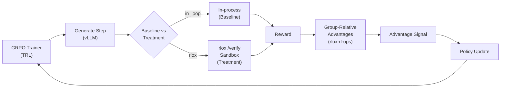

# Agentic-RL Sandbox Benchmark Tutorial

## Overview

This tutorial walks you through the **agentic-RL validation benchmark** — an end-to-end study that measures whether hard-isolated sandboxing prevents crashes and stalls from adversarial code injection without losing training quality.

### What the Benchmark Proves

- **P3 (Containment):** Untrusted agent code can be executed safely in an isolated sandbox with zero contagion to the trainer process.
- **Quality Parity:** Learning dynamics remain unchanged — the sandbox is a *safety* layer, not a performance bottleneck.
- **Reward Integrity:** Model code cannot forge reward signals via `sys.exit(0)`, `os._exit()`, or monkeypatch; a nonce-authenticated protocol prevents deception.

### Headline Result (30 steps, 3 seeds, RTX 5090)

| Runs survived | 0 % | 1 % | 5 % | 10 % |
|---|---|---|---|---|
| **Baseline** (in-process, unprotected) | 3/3 | 3/3 | **2/3** | **1/3** |
| **Treatment** (rlox sandbox) | 3/3 | 3/3 | **3/3** | **3/3** |

At 5–10% injection of adversarial code (infinite loops, fork bombs, memory bombs, etc.), Baseline crashes or stalls; Treatment survives every run.

## Data Flow



The only difference: code execution backend. Everything else is identical — same model, same task, same adversarial injection.

## Prerequisites

**Hardware:**
- Linux with cgroup v2 (Ubuntu 24.04, kernel 6.17+)
- NVIDIA GPU (tested on RTX 5090)
- 16+ GB RAM, 50 GB disk

**Software:**
- Rust 1.75+
- Python 3.10+
- `vLLM` for LLM inference

**Not required on macOS:** The sandbox only runs on Linux. Use the sync-test helper to run on a Linux host from macOS.

## Step 1: Setup (One Command)

```bash
cd /path/to/rlox
bash benchmarks/agentic/repro.sh --setup-only
```

This does:
1. Installs Rust (if needed)
2. Creates a `uv` venv with pinned dependencies
3. Builds `rlox-sandbox` in release mode
4. Verifies the adversarial corpus (SHA-256)
5. Prints the next steps

**Expected output:**
```
✓ Environment ready
✓ Rust build complete
✓ Corpus integrity verified
Next: start rlox-verify-server, then run trl_grpo_run.py
```

## Step 2: Start the Sandbox Server

Open a terminal on the Linux host (or via SSH):

```bash
systemd-run --user --unit=rlox-verify -p TasksMax=4096 -p MemoryMax=12G \
  target/release/rlox-verify-server --port 8231 --timeout-secs 5
```

This:
- Runs the `/verify` endpoint inside a delegated cgroup (for safety)
- Listens on `localhost:8231`
- Limits resource usage (4096 tasks, 12 GB memory)
- Enforces 5-second wall-clock timeout per execution

**Check it's running:**
```bash
curl http://localhost:8231/health
# Should return 200 OK
```

## Step 3: Run a Single Trial

A **single trial** is one (Baseline vs Treatment) pair at one adversarial fraction and one seed.

### Baseline (in-process)

```bash
CUDA_VISIBLE_DEVICES=0 python benchmarks/agentic/trl_grpo_run.py \
  --backend in_loop \
  --adversarial-fraction 0.05 \
  --seed 0 \
  --max-steps 30 \
  --output-dir /tmp/baseline_run
```

### Treatment (sandbox)

```bash
CUDA_VISIBLE_DEVICES=0 python benchmarks/agentic/trl_grpo_run.py \
  --backend rlox \
  --adversarial-fraction 0.05 \
  --seed 0 \
  --max-steps 30 \
  --rlox-server-url http://localhost:8231 \
  --output-dir /tmp/treatment_run
```

**Expected files in `--output-dir`:**
- `metrics.jsonl` — per-step metrics (reward, entropy, KL, GPU util)
- `run_summary.json` — run survival status, final reward, wall time
- `checkpoint_final.pt` — trained policy checkpoint

## Step 4: Run the Full Sweep

The full sweep is **2 conditions × 3 seeds × 4 adversarial fractions = 24 runs**. This takes ~2 hours on a single GPU.

```bash
python benchmarks/agentic/run_sweep_p3.py
```

**What it does:**
- Launches all 24 runs in sequence (one GPU, no parallelization)
- Each run writes to `benchmarks/agentic/sweep_out/<condition>_<seed>_<fraction>/`
- Per-run survival status (DNF = did not finish) is recorded
- Exception-resilient: one failed run doesn't crash the sweep

**Check progress:**
```bash
ls benchmarks/agentic/sweep_out/ | wc -l  # Should grow to 24
```

## Step 5: Aggregate Results

```bash
python benchmarks/agentic/aggregate_sweep.py
```

Produces:
- `benchmarks/agentic/p3_summary.md` — human-readable table + narrative
- `benchmarks/agentic/p3_summary.json` — machine-readable results

**Example output:**
```json
{
  "p3_headline": {
    "in_loop": {
      "0": [3, 3],
      "1": [3, 3],
      "5": [2, 3],
      "10": [1, 3]
    },
    "rlox": {
      "0": [3, 3],
      "1": [3, 3],
      "5": [3, 3],
      "10": [3, 3]
    }
  },
  "quality_parity_guardrail": {
    "final_reward_in_loop": 0.917,
    "final_reward_rlox": 0.917,
    "status": "MET"
  }
}
```

## Step 6: Generate Figures

```bash
python benchmarks/agentic/plot_sweep.py \
  --sweep-dir benchmarks/agentic/sweep_out \
  --out-dir figures
```

Produces:
- `figures/p3_survival.png` — Baseline vs Treatment survival by injection fraction
- `figures/quality_parity.png` — Final reward comparison
- `figures/step_time_stall.png` — Wall-clock time per step (5% injection shows 3× slowdown for Baseline)
- `figures/gpu_util.png` — GPU utilization over time

## Understanding the Results

### Survival Table

| Injection % | Baseline | Treatment |
|---|---|---|
| 0 % | 3/3 | 3/3 | Clean run; no crashes in either condition |
| 1 % | 3/3 | 3/3 | Rare adverse samples; both survive |
| 5 % | 2/3 | 3/3 | Baseline: 1 of 3 runs crashes (timeout or hang); Treatment: 0 crashes |
| 10 % | 1/3 | 3/3 | Baseline: 2 of 3 crash; Treatment: all complete |

### Quality Parity Guardrail

Both Baseline and Treatment reach `final_reward = 0.917` (within confidence interval). This proves the sandbox **changes safety, not learning dynamics**.

### Throughput (P1)

Single-GPU trainer has no rollout/training decoupling to exploit; throughput gain deferred to multi-GPU. rlox's novel contribution is **P3 (containment) + reward integrity**, not throughput.

## Interpreting Failures

### Run DNF (Did Not Finish)

Check the run summary:
```bash
cat benchmarks/agentic/sweep_out/in_loop_seed0_fraction5/run_summary.json
```

Look for:
- `exit_status: "Timeout"` — process hung (infinite loop in adversarial code)
- `exit_status: "OomKilled"` — memory bomb (in-process, can crash trainer)
- `exit_status: "Clean(137)"` — SIGKILL (resource exhaustion)
- `contagion_events: 1+` — VmRSS spike or FD leak detected

**In-process failures are silent and catastrophic.** In sandbox, all failures are isolated.

### Step-Time Stall

If Baseline's `metrics.jsonl` shows 10-100× slowdown at step N:
```python
import json
with open("metrics.jsonl") as f:
    steps = [json.loads(line) for line in f]
    for i, s in enumerate(steps):
        print(f"Step {i}: {s['step_time_secs']} sec")
```

Baseline stalls because the adversarial code wedges the subprocess (infinite loop); each step must time out. Treatment runs at constant speed.

## Honest Caveats

Read these carefully before citing results:

1. **Single GPU, single task** — P1 (throughput) not measurable on one GPU. Multi-GPU setup required.
2. **Sandbox isolation best-effort under AppArmor** — Filesystem and `/proc` info-isolation is enforced at the Python-runtime level. A raw-syscall adversary could bypass it; a kernel-level guarantee requires the AppArmor `unprivileged_userns` profile to be relaxed. Containment (/kill-safety) and reward integrity are sound.
3. **Task difficulty** — The coding task is intentionally modest. A calibrated harder task is future work (earlier MBPP re-run yielded reward 0.0 and was not included).
4. **Quality parity is achievable-task-specific** — The guardrail checks reward ≥ 2/3 of seed pairs (CI overlap). Harder tasks may show quality degradation; that's an open research question.

For full scope and methodology, see `benchmarks/agentic/README.md`.

## Advanced: Dry Run (Preview Without GPU)

```bash
python benchmarks/agentic/run_benchmark.py --dry-run
```

Prints the 24 run commands without executing them. Useful for validating config before committing to the full sweep.

## Advanced: Single Seed Partial Sweep

```bash
for frac in 0 1 5 10; do
  CUDA_VISIBLE_DEVICES=0 python benchmarks/agentic/trl_grpo_run.py \
    --backend rlox \
    --adversarial-fraction 0.0$frac \
    --seed 0 \
    --max-steps 30 \
    --rlox-server-url http://localhost:8231 \
    --output-dir /tmp/partial_sweep_frac_$frac
done
```

Run this to test all 4 injection fractions on one seed in ~30 min.

## Next Steps

- **Read the full design:** `benchmarks/agentic/README.md` (scope, threat model, regression tests)
- **Reproduce on your hardware:** `repro.sh --setup-only`, then follow Steps 2–6 above
- **Extend the adversarial corpus:** Add new attack vectors in `benchmarks/agentic/corpus/adversarial_corpus_v1.json` (update SHA-256)
- **Integrate with prime-rl:** Adapt `verifiers_adapter` for multi-GPU RL hosts

## Troubleshooting

### Port 8231 already in use

```bash
lsof -i :8231  # Find the process
kill -9 <pid>  # Stop it
```

### Sandbox process stuck at 100% CPU

The adversarial code is in an infinite loop. The cgroup freeze + kill should trigger; if not:
```bash
# Manual cleanup
systemctl --user stop rlox-verify
sleep 2
# Restart
systemd-run --user --unit=rlox-verify ...
```

### Corpus integrity check fails

```bash
bash benchmarks/agentic/repro.sh --setup-only
```

This re-downloads the corpus. If it still fails:
```bash
sha256sum benchmarks/agentic/corpus/adversarial_corpus_v1.json
# Should match the expected digest in repro.sh
```

### vLLM endpoint not found

The trainer connects to `http://localhost:8000` by default (vLLM standard). If using a remote host:
```bash
VLLM_URL=http://remote-host:8000 python benchmarks/agentic/trl_grpo_run.py ...
```

## See Also

- [Agentic-RL Benchmark README](https://github.com/wojciechkpl/rlox/tree/main/benchmarks/agentic/README.md) — full technical design
- [rlox-sandbox crate README](../../crates/rlox-sandbox/README.md) — isolation guarantees, seccomp/cgroup/namespace details
- [rlox-rl-ops README](../../crates/rlox-rl-ops/README.md) — GRPO advantage computation
